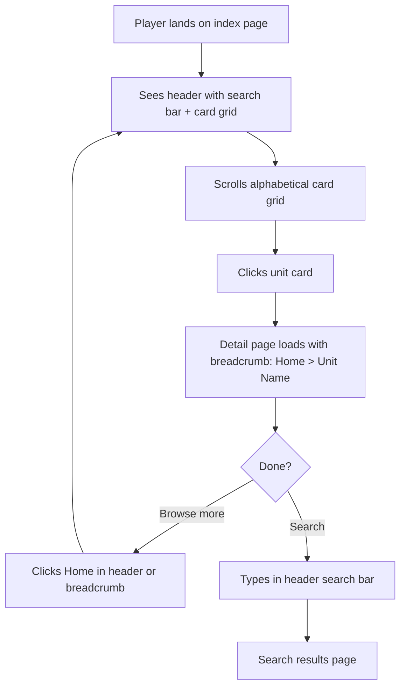
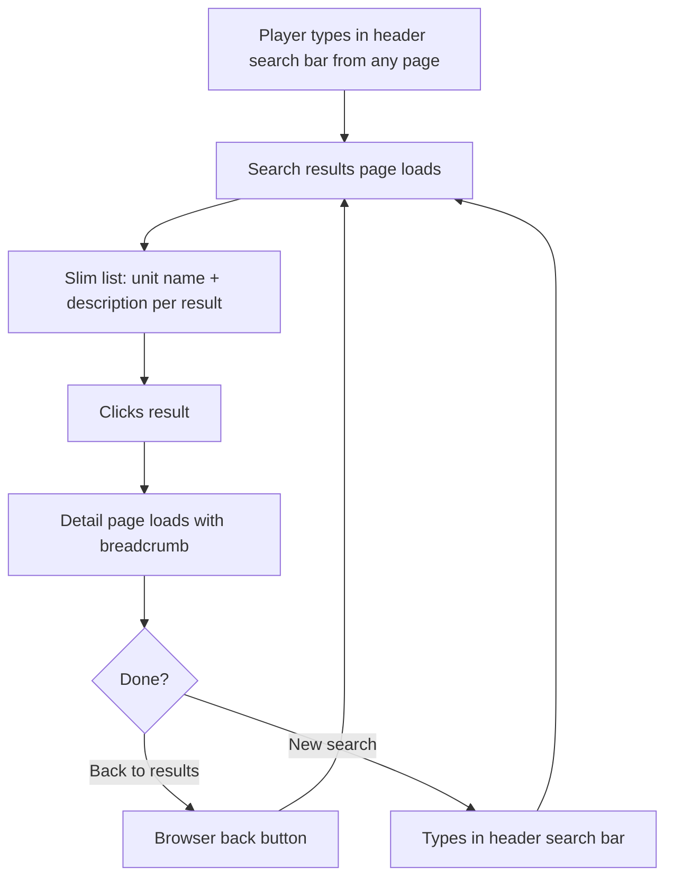
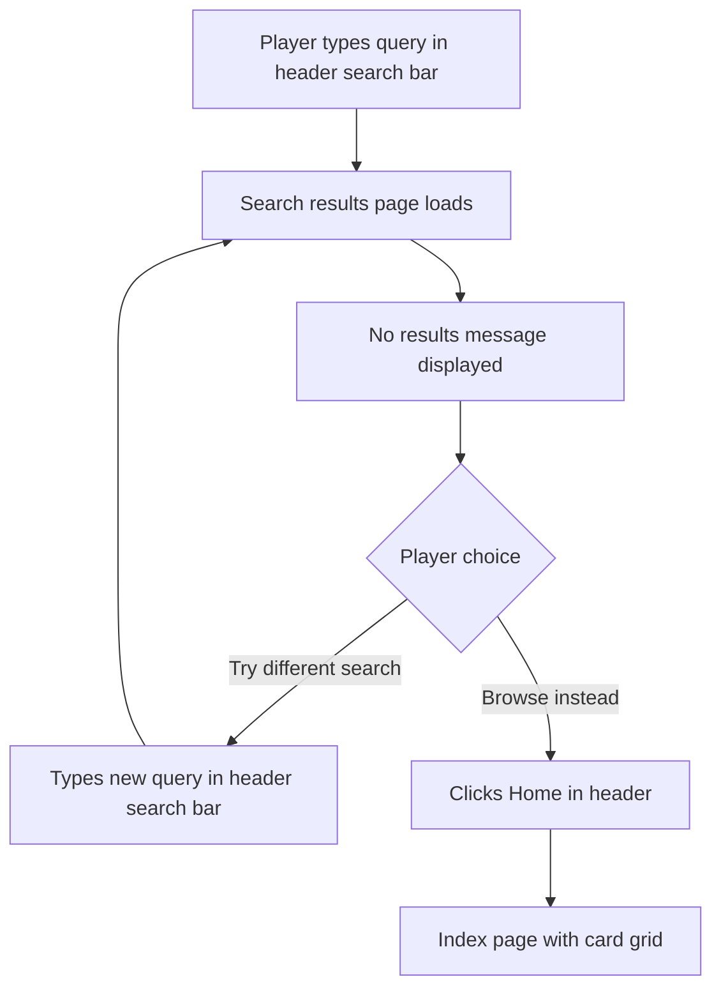
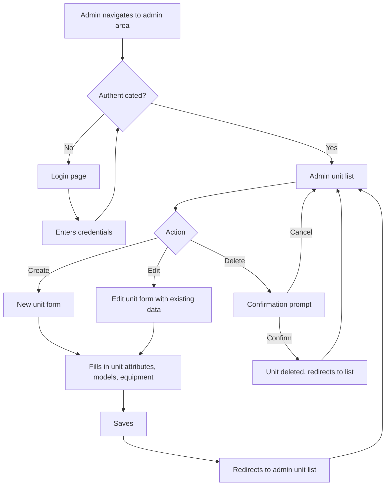

---
stepsCompleted:
  - 1
  - 2
  - 3
  - 4
  - 5
  - 6
  - 7
  - 8
  - 9
  - 10
  - 11
  - 12
  - 13
  - 14
inputDocuments:
  - prd.md
---

# UX Design Specification - aine-program

**Author:** B
**Date:** 2026-02-18

---

<!-- UX design content will be appended sequentially through collaborative workflow steps -->

## Executive Summary

### Project Vision

MPA web app for tabletop wargame players to browse, search, and view units for their games. Replaces scattered rulebook lookups with a clean digital reference and selection tool. Server-rendered for SEO, responsive, WCAG AA compliant.

### Target Users

**Players** — Hobbyists planning tabletop sessions. Looking up units, comparing options, building lineups. Moderate tech comfort. Primarily desktop, mobile should work. Use case is pre-game planning.

**Admin (B)** — Sole content manager. Needs efficient data entry for units, models, and equipment options via authenticated CRUD pages.

### Key Design Challenges

- **Unit detail page complexity** — Units contain models, models have default equipment plus alternative options. Displaying this hierarchy clearly without overwhelming the player is the core UX challenge.
- **Equipment option clarity** — Players need to instantly see what's default vs. what's swappable, per model. The visual relationship between models and their equipment choices must be intuitive.
- **Admin data entry efficiency** — Nested data (unit > models > equipment options) could be tedious. Admin forms need to handle this hierarchy without excessive page loads or confusion.

### Design Opportunities

- **Scannable index** — Well-designed index with just enough summary info for quick narrowing without clicking into every detail page.
- **Clear visual hierarchy on detail pages** — Smart layout showing unit > model > equipment relationships at a glance.
- **Fast navigation patterns** — Breadcrumbs and back-to-index shortcuts keep browsing flow smooth.

## Core User Experience

### Defining Experience

The core interaction is **browse, find, drill in**. Players scroll the index to scan unit cards, or search by name, then tap into a detail page for the full picture. The index is the front door; the detail page is where value is delivered.

### Platform Strategy

- Web MPA, server-rendered, desktop-primary with responsive mobile support
- Mouse/keyboard primary interaction; touch-friendly on mobile
- No offline requirement — content is always fetched from server
- No device-specific capabilities needed

### Effortless Interactions

- **Index browsing** — Scroll and scan. Unit cards fill the available screen width in a responsive grid. Each card shows a summary (name, key attributes, brief description) — no equipment details at this level. Zero interaction required to start browsing.
- **Search** — Slim results page. Each result shows only unit name and description. One click to the detail page. No clutter.
- **Detail page** — Rich and complete. All unit attributes, every model, all equipment options with defaults clearly distinguished. This is where players spend their time — it needs to be dense but readable.
- **Navigation** — Effortless back-and-forth between index and detail pages. Never more than one click away from the index.

### Critical Success Moments

- **Index landing** — Player opens the site and immediately sees a clean grid of unit cards they can scan. No friction.
- **Detail page payoff** — Player clicks a unit and gets everything they need on one page — stats, models, equipment defaults, and all swap options. No digging.
- **Search resolution** — Player types a name, sees a slim result list, clicks through. Fast and direct.

### Experience Principles

1. **Cards-first browsing** — The index is a responsive card grid that fills the screen. Scannable at a glance.
2. **Summary vs. detail separation** — Index cards show just enough to identify a unit. Detail pages show everything. No middle ground.
3. **Rich detail, clear hierarchy** — Detail pages are information-dense but visually organized: unit > models > equipment options.
4. **Slim search** — Search results are minimal (name + description). Get the player to the detail page fast.

## Desired Emotional Response

### Primary Emotional Goals

**Clarity** — The dominant feeling at every touchpoint. Players should never wonder where to look, what a piece of information means, or how to get to what they need. The interface communicates through structure, not explanation.

### Emotional Journey Mapping

- **First visit** — Immediate orientation. Player sees the card grid and understands the site instantly.
- **Browsing** — Calm scanning. Cards are uniform and predictable — easy to compare at a glance.
- **Detail page** — Comprehension. Dense information presented with clear hierarchy. Unit > models > equipment reads naturally top to bottom.
- **Search** — Directness. Type, see results, click. No ambiguity about what matched or where to go next.
- **Error states** — No confusion. Empty results say so plainly with an obvious path back to browsing.

### Design Implications

- **Clarity** → Consistent card layout, predictable information placement, strong visual hierarchy on detail pages
- **Confidence** → Accurate, complete data on every detail page — no missing fields or ambiguous labels
- **Efficiency** → Minimal clicks, fast page loads, no unnecessary UI chrome between the player and the information

### Emotional Design Principles

1. **Structure communicates** — Layout and hierarchy do the work, not labels or instructions
2. **Predictability builds trust** — Every card looks the same, every detail page follows the same pattern
3. **Nothing extra** — If a UI element doesn't directly serve clarity, remove it

## UX Pattern Analysis & Inspiration

### Inspiring Products Analysis

**Craigslist** — The gold standard for "get out of the way" design. No visual noise, no unnecessary decoration, no competing UI elements. Content is the interface. Users scan, click, and get what they need. The design disappears entirely.

### Transferable UX Patterns

**Layout Patterns:**
- **Tables** for structured data display — unit attributes, model stats, equipment listings. Rows and columns communicate relationships without extra UI.
- **Definition lists** for label-value pairs — unit properties, equipment details. Clean semantic pairing of term and description.
- **Plain card grid on index** — Minimal card styling. Name, key summary info. No shadows, no rounded corners, no decoration competing with content.
- **Summary/details elements** for rules text — Collapsible blurbs that keep the page scannable while making rules available on demand. Native HTML, no JavaScript, accessible by default.

**Interaction Patterns:**
- **Text links over buttons** — Plain hyperlinks for navigation. No styled CTAs on public pages.
- **Inline content for data, collapsible for prose** — Stats and equipment always visible. Longer rules text tucked behind `
` to keep the page focused.
- **Simple form inputs** — Admin forms use native browser controls. No custom widgets.

**Visual Patterns:**
- **System fonts** — No custom typefaces. Fast loading, familiar to users.
- **Minimal color** — Near-monochrome with perhaps one accent color for links. Let content contrast do the work.
- **No images or icons in UI** — Text labels only. No decorative elements.

### Anti-Patterns to Avoid

- **Visual flourish** — Gradients, shadows, animations, hover effects. All noise for this product.
- **Complex components** — Tabs, carousels, collapsible sections beyond native details/summary. Everything data-related should be visible and static.
- **Heavy frameworks** — Overly styled component libraries that impose their own visual identity.
- **Marketing patterns** — Hero sections, CTAs, testimonials. This is a tool, not a landing page.

### Design Inspiration Strategy

**Adopt:**
- Tables and definition lists as primary content display patterns
- Native summary/details for rules text
- Craigslist-level minimalism — content is the interface
- System fonts, minimal color, no decoration

**Adapt:**
- Card grid for index — keep it plain but use enough structure to make scanning easy
- Responsive table handling for mobile — may need to stack or reflow on small screens

**Avoid:**
- Any UI element that doesn't directly display unit data
- Any styling that draws attention to itself rather than the content

## Design System Foundation

### Design System Choice

**Custom CSS with BEM methodology.** No framework, no preprocessor, no utility classes. Plain CSS only.

### Rationale for Selection

- **No framework overhead** — Frameworks impose visual identity and add weight. This project needs neither.
- **Native HTML does the heavy lifting** — Tables, definition lists, and summary/details elements look fine with minimal styling. The CSS layer is thin.
- **BEM class naming** — Block-Element-Modifier convention provides structure and predictability to class names without tooling. Examples: `.unit-card`, `.unit-card__title`, `.unit-card--highlighted`.
- **Solo developer** — No team coordination overhead. One person, one stylesheet, full control.
- **WCAG AA alignment** — Custom CSS makes it straightforward to enforce contrast ratios and spacing without fighting framework defaults.

### Implementation Approach

- Single CSS file (or small set of files split by concern)
- BEM naming convention throughout: `.block__element--modifier`
- CSS custom properties for the small set of design tokens (colors, spacing, font sizes)
- No build step required — plain CSS served directly
- Responsive layout via CSS Grid for the card index, standard flow for everything else

### Customization Strategy

- **Design tokens via CSS custom properties:**
  - One accent color (links)
  - Base text color, background color
  - Font stack (system fonts)
  - Spacing scale (small set of consistent values)
  - Border/divider color
- **Component styles are minimal:**
  - `.unit-card` — index card grid items
  - `.unit-detail` — detail page layout
  - `.search-results` — slim results list
  - `.admin-form` — CRUD form styling
  - Native element styling for tables, definition lists, summary/details

## Core Interaction Design

### Defining Experience

**"Find a unit and see everything about it."** That's the one-sentence description a player would give a friend. The entire UX funnels toward getting from the index to a unit's full detail page as quickly and clearly as possible.

### User Mental Model

Players already have a mental model for this: it's a **reference catalog**. They expect to flip through entries, look things up, and read details. The closest analog is browsing a wiki or a product catalog. No learning curve — the patterns are immediately familiar.

### Success Criteria

- Player lands on index and starts scanning within 1 second — no orientation needed
- Player reaches any unit's detail page in 2 clicks or fewer (index → detail, or search → result → detail)
- Detail page answers "what are my options for this unit?" without scrolling past the fold on desktop
- Player never wonders "where do I go from here?" — navigation is always obvious

### UX Pattern Analysis

**Entirely established patterns:**
- Card grid index → standard catalog browsing
- Search bar → universal web convention
- Detail page with tables and definition lists → standard reference layout
- Summary/details for rules text → native HTML progressive disclosure
- Breadcrumb or back link → standard navigation

No novel patterns needed. No user education required.

### Experience Mechanics

**1. Initiation:** Player loads the site. Index page is the landing page. Cards are immediately visible.

**2. Browsing:** Scroll the card grid. Each card shows unit name and summary. Click any card to open its detail page.

**3. Searching:** Type in the search bar (present on every page or at least on the index). Results page shows name + description only. Click a result to open the detail page.

**4. Detail consumption:** Unit detail page displays all attributes in tables/definition lists. Models listed with their default equipment. Equipment options shown per model with clear indication of what's default vs. swappable. Rules text in collapsible summary/details elements.

**5. Navigation:** Back to index link always available. Breadcrumb or simple text link. No dead ends.

## Visual Design Foundation

### Color System

| Token | Value | Usage |
|---|---|---|
| `--color-bg` | `#FFFFFF` | Page background |
| `--color-text` | `#000000` | Primary text |
| `--color-muted` | `#666666` | Secondary text, borders, dividers |
| `--color-accent` | `#960B09` | Links, interactive elements, emphasis |
| `--color-accent-dark` | `#4A0F06` | Hover states, active states |

### Typography System

- **Font stack:** `"Merriweather", Georgia, "Times New Roman", serif`
- **Source:** Google Fonts or self-hosted
- **Weights loaded:** 400 (regular), 700 (bold)
- **Base size:** 16px
- **Scale:** Body 1rem, h3 1.125rem, h2 1.25rem, h1 1.5rem
- **Line height:** 1.6 for body text, 1.2 for headings

### Spacing & Layout Foundation

- **All distances in rem** — no px values for spacing, padding, or margins
- **Spacing tokens deferred** — will be established as CSS custom properties once the app is running
- **Density:** Compact — more data visible, less whitespace
- **Card grid:** CSS Grid, auto-fill columns
- **Max content width:** ~75rem
- **Tables:** Full width, compact cell padding

### Accessibility Considerations

- `#960B09` on white: ~7:1 contrast — passes AA
- `#4A0F06` on white: ~13:1 contrast — passes AA
- `#666666` on white: ~5.7:1 contrast — passes AA
- Focus indicators using accent red outline for keyboard navigation

## Design Direction Decision

### Design Directions Explored

Single direction explored — the visual direction was already fully defined through prior steps: Craigslist-plain minimalism, tables, definition lists, native summary/details, BEM CSS, Merriweather serif, red/black/gray palette.

### Chosen Direction

Plain, content-first design with no visual decoration. See HTML mockup at `ux-design-directions.html` with external stylesheet `ux-design-directions.css`.

**Key elements:**
- Responsive card grid on index with 1px gray borders, no shadows or rounded corners
- Slim search results — name and description only
- Rich detail pages with definition lists for attributes, tables for weapon stats, summary/details for rules text
- Model sections boxed with border to show unit > model hierarchy
- Admin forms use native browser controls with BEM-styled labels
- Accent red (`#960B09`) for links and interactive elements only
- Breadcrumb navigation on detail and admin pages

### Design Rationale

- Matches the "clarity" emotional goal — structure communicates, not decoration
- Craigslist-level minimalism keeps focus on unit data
- Native HTML elements (tables, dl, details) are semantic, accessible, and need minimal styling
- BEM CSS with no framework means zero visual overhead and full control
- Merriweather provides readable serif typography that works at all sizes

### Implementation Approach

- External CSS file with BEM class names
- Color custom properties only — spacing tokens deferred until working app
- Direct rem values for all spacing
- Google Fonts or self-hosted Merriweather (400, 700 weights)
- No build step — plain CSS served directly

## User Journey Flows

### Global Navigation

Every page has a static header with:
- Site name linked to homepage (index)
- Search bar

Every detail/admin page has a breadcrumb below the header. Browser back/forward works naturally since this is a standard MPA with real page loads.

### Journey 1: Browse Index → Unit Detail

### Journey 2: Search → Results → Unit Detail

### Journey 3: Search → No Results → Fallback

### Journey 4: Admin CRUD

### Journey Patterns

**Navigation patterns:**
- **Persistent header** — Site name (home link) + search bar on every page. Always one click or one search away from anywhere.
- **Breadcrumb** — On detail and admin pages. Shows path: Home > Unit Name. Simple text links.
- **Browser native** — MPA architecture means back/forward work perfectly without any special handling.

**Feedback patterns:**
- **Empty state** — Clear "no results" message on search with no dead end — header search bar and home link always available.
- **Confirmation** — Delete actions require explicit confirmation before executing.
- **Redirect** — Admin save/delete actions redirect to the unit list, confirming success implicitly.

### Flow Optimization Principles

1. **No dead ends** — Header with home link and search bar is always present. Every page has a way forward.
2. **Browser-native navigation** — Real page loads, real URLs, back/forward just works. No client-side routing tricks.
3. **Minimal clicks to value** — Index is one click to detail. Search is one submission + one click to detail.
4. **Flat admin flow** — List → form → save → back to list. No nested workflows for unit/model/equipment management.

## Component Strategy

### Native HTML Components

Browser-native elements needing only light styling:
- `<table>` — weapon stats, model attributes
- `<dl>` — unit attribute key-value pairs
- `
/
` — collapsible rules text
- `<form>` inputs, labels, textareas — admin forms
- `<a>` — all navigation, links

### Custom BEM Components

| Component | BEM Block | Purpose | Used On |
|---|---|---|---|
| Site header | `.site-header` | Persistent header with home link + search bar | Every page |
| Breadcrumb | `.breadcrumb` | Path navigation: Home > Unit Name | Detail, admin pages |
| Unit card | `.unit-card` | Summary card in index grid | Index page |
| Unit grid | `.unit-grid` | Responsive card grid layout | Index page |
| Search form | `.search-form` | Search input in header | Every page (via header) |
| Search results list | `.search-results` | Slim name + description result items | Search results page |
| Empty state | `.empty-state` | "No results" message | Search results page |
| Admin form | `.admin-form` | CRUD form layout | Admin pages |

### Component States

- **Links:** default (accent red), hover (dark red), focus (red outline)
- **Form inputs:** default (gray border), focus (red border + outline)
- **Details/summary:** closed (collapsed), open (expanded with content below)
- **Empty state:** static — just a text message

### Implementation Notes

- All components are MVP — no phased rollout needed. The component list is small enough to build in one pass.
- No JavaScript components. Everything is server-rendered HTML + CSS.
- The only interactive element beyond links and forms is the native `
/
`.

## UX Consistency Patterns

### Navigation Patterns

- **Header:** Present on every page. Contains site name (links to index) and search form. No other navigation elements.
- **Breadcrumb:** Present on detail and admin pages. Format: `Home > Page Name`. Plain text links separated by `>`.
- **Links:** Always accent red, always underlined. No styled buttons on public pages.

### Form Patterns

- **Admin forms only** — no forms on public pages except the search bar.
- **Labels:** Always above the input, bold, using `<label>` with `for` attribute.
- **Required fields:** Mark with both "(required)" text and an asterisk `*` in the label.
- **Validation:** Server-side. On error, re-render the form with error messages adjacent to the relevant field.
- **Submit:** Single action per form. Saves and redirects to the admin list.

### Search Pattern

- **Input:** Plain text input in the header. Standard form submission.
- **Results:** Slim list — unit name as link, description below in muted text.
- **No results:** Plain text message: "No units found matching [query]." No suggestions or "did you mean" — keep it simple.
- **Empty query:** Redirect to index.

### Feedback Patterns

- **Success:** Implicit. Admin save redirects to list — presence of the updated item confirms success.
- **Error:** Server-rendered error messages inline with the form field that caused the issue. Red accent color for error text.
- **Delete confirmation:** Browser-native `confirm()` dialog before destructive actions. No custom modal.
- **Loading:** None needed. Server-rendered MPA — pages load as full HTML. No spinners or skeleton screens.

### Empty States

- **Search no results:** Text message with the query echoed back. Header search bar available for retry.
- **Admin empty list:** Text message: "No units yet." with a link to create one.
- **Index empty:** Same pattern — text message with admin link (if authenticated).

### Data Display Patterns

- **Key-value data:** Always `<dl>` (definition list).
- **Tabular data:** Always `<table>` with `<thead>` headers.
- **Long prose/rules:** Always `
/
`, collapsed by default.
- **Hierarchy (unit > model > equipment):** Shown through nesting and visual containment (borders), not indentation alone.

## Responsive Design & Accessibility

### Responsive Strategy

**Intrinsic design — no media queries.** Layout adapts through CSS Grid and Flexbox behavior rather than breakpoint-driven overrides.

- **Card grid:** `grid-template-columns: repeat(auto-fill, minmax(18rem, 1fr))` — cards fill available space naturally. Single column on narrow screens, multi-column on wide screens, no breakpoints needed.
- **Tables:** Allow horizontal scroll on narrow viewports via `overflow-x: auto` on a wrapper. No reflow — tables stay tabular.
- **Header:** Flexbox with wrap. Site name and search bar flow naturally. Search input uses percentage or viewport-relative width.
- **Content width:** Max-width cap on the page container. Content flows naturally within.

### Scaling Strategy

- **Viewport units for scaling** — Use `vw`-based values (via `clamp()`) for font sizes and key spacing where appropriate, so the design scales smoothly rather than jumping at breakpoints.
- **Example:** `font-size: clamp(1rem, 0.9rem + 0.5vw, 1.5rem)` for headings — scales with viewport width, capped at min and max.
- **Rem for structural spacing** — Padding, margins, gaps stay in rem for consistency.
- **No `@media` rules** — All adaptation is intrinsic to the layout and sizing rules.

### Accessibility Strategy

**WCAG AA compliance across all public pages.**

**Color & Contrast:**
- All text meets 4.5:1 minimum contrast against background
- All color tokens already verified (see Visual Design Foundation)
- No information conveyed by color alone

**Keyboard Navigation:**
- All interactive elements reachable via Tab
- Focus indicators: 2px accent red outline with offset
- Skip-to-content link as first focusable element
- Native `
/
` is keyboard-accessible by default

**Semantic HTML:**
- Logical heading hierarchy (h1 > h2 > h3) on every page
- `<nav>` for navigation, `<main>` for content, `<header>` for site header
- `<table>` with `<thead>` for data tables
- `<label>` with `for` on all form inputs
- `<form>` for search and admin forms

**Screen Readers:**
- Descriptive link text (no "click here")
- Table headers associated with data cells
- Form error messages linked to inputs via `aria-describedby`
- Breadcrumb wrapped in `<nav aria-label="Breadcrumb">`

### Testing Approach

- Test layouts by resizing browser — no breakpoints means smooth scaling at every width
- Validate with keyboard-only navigation
- Run automated accessibility checks (axe, Lighthouse)
- Verify contrast ratios with browser dev tools
- Test with screen reader (VoiceOver or NVDA) on key pages
